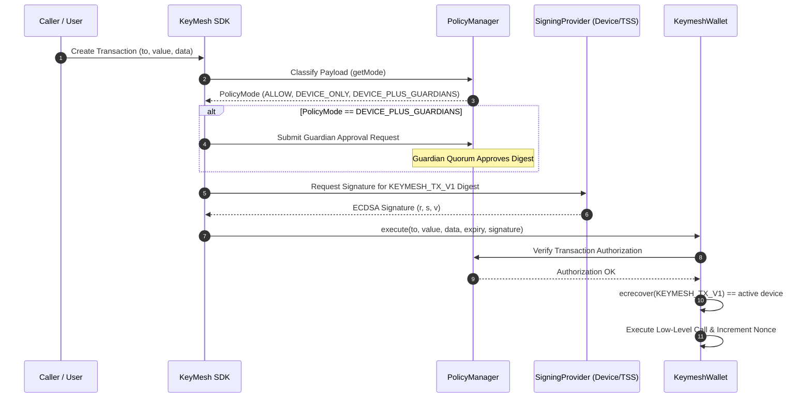
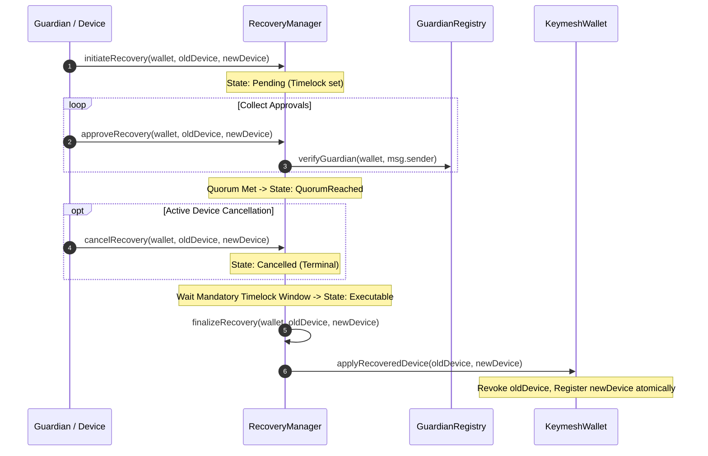
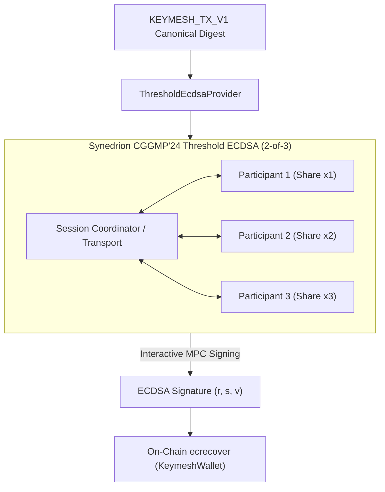
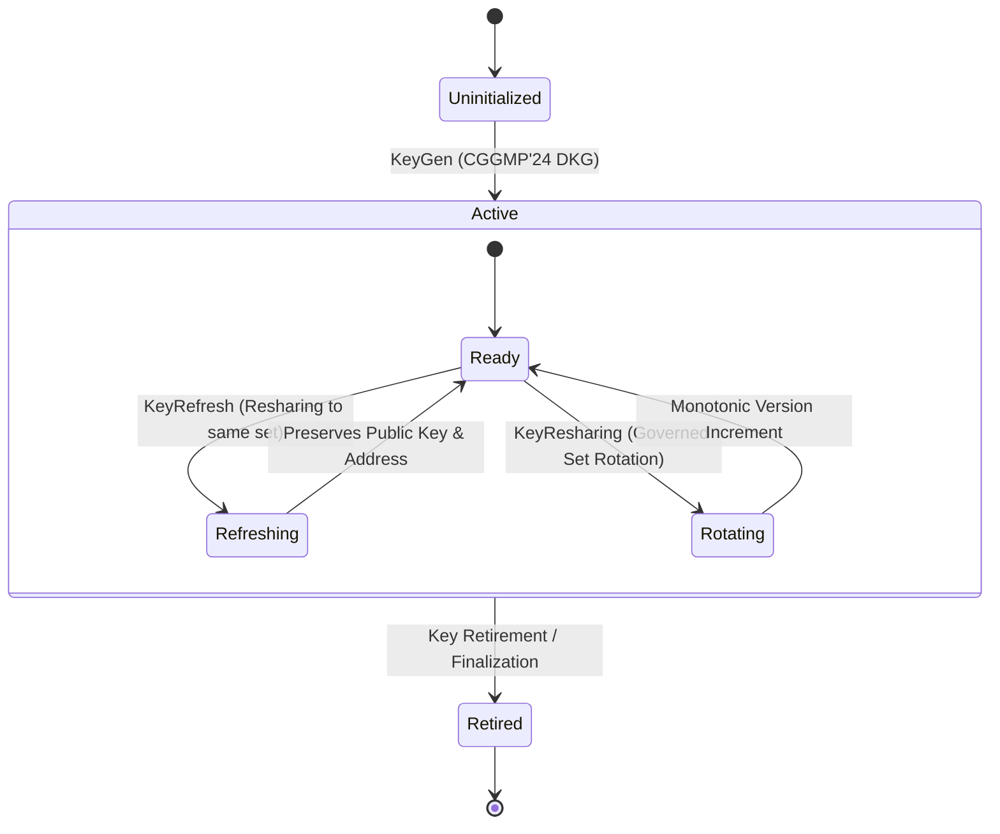

# KeyMesh Architecture & Component Overview

> **Status:** Phase 2.7 Complete / Freeze Architecture

KeyMesh distributes authority over digital asset transactions across device signatures, policy engines, and guardian recovery quorums.

---

## 1. System Overview Architecture

```mermaid
graph TD
    Client["Client / SDK / Dashboard"] -->|KEYMESH_TX_V1| SigningLayer["Signing Layer (SigningProvider)"]
    
    subgraph SigningLayer ["Signing Layer (SigningProvider)"]
        SingleECDSA["SingleEcdsaProvider"]
        ThresholdECDSA["ThresholdEcdsaProvider (CGGMP'24)"]
    end

    SigningLayer -->|ECDSA Signature (r, s, v)| KeymeshWallet["KeymeshWallet.sol (On-Chain)"]

    subgraph Governance ["On-Chain Security & Governance"]
        PolicyMgr["PolicyManager.sol"]
        RecoveryMgr["RecoveryManager.sol"]
        GuardianReg["GuardianRegistry.sol"]
    end

    KeymeshWallet -->|Classify Policy| PolicyMgr
    RecoveryMgr -->|Manage Quorums| GuardianReg
    RecoveryMgr -->|Apply Replaced Device| KeymeshWallet
```

---

## 2. Transaction Authorization Flow



---

## 3. Guardian Recovery & Device Replacement Flow



---

## 4. Threshold Cryptography Architecture (CGGMP'24)



---

## 5. TSS Key Lifecycle State Machine


